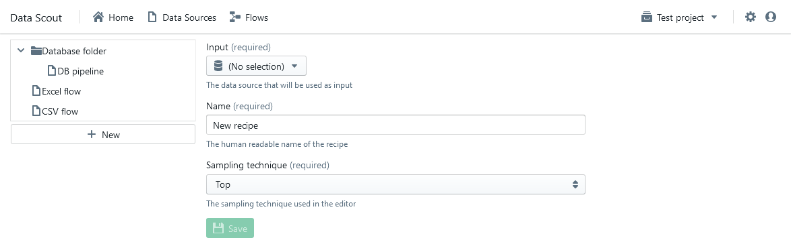
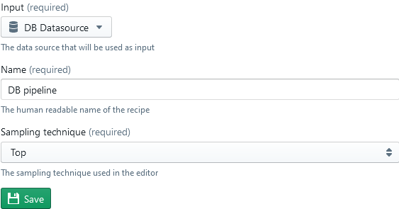

Flows
=====
Flows, or recipes as they're sometimes called, are how you define your data preparation pipeline. A flow can either have a data source or a join as input. It then defines transformations that are performed on this input.
You can create a new flow on the overview page. After you've created it, the flow itself can be edited in the data wrangler (see the next section). The data wrangler can be opened by double clicking the flow.

The image above depicts the flows overview page. On the left of the screen an explorer is visible, the middle of the page contains an edit/create pane. 
A right click in the explorer bring up a context menu that allows flows and folders to be moved or deleted.

.. image:: ../assets/flows_context_menu.png
  :alt: Context menu in the explorer view

By pressing the "New" button at the bottom of the explorer a flow can be created. To edit a flow, simply select it in the explorer. In the field list you'll find a "sampling technique". This determines how the data that is shown in the wrangler is sampled (for useability reasons only a subset of the data is evaluated).

